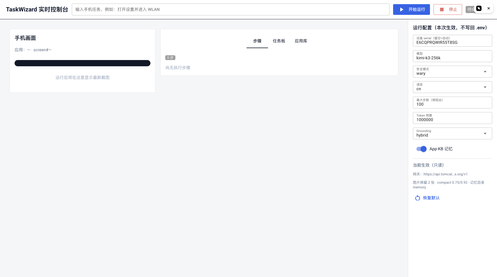

# Web 控制台

TaskWizard 自带一个本地 Web 控制台（NiceGUI），用于实时监看与操控运行。

```bash
.venv/bin/python -m phone_agent.web --device-id <serial> --port 8080
# 打开 http://127.0.0.1:8080
```



## 界面三区

| 区 | 内容 |
|---|---|
| **左：手机画面** | 最新截图（等比完整显示）+ 缩略图历史——点缩略图可 pin 住某一帧对比，再点回到"跟随最新" |
| **中：步骤 / 任务板 / 应用库** | 步骤时间线（可展开看参数、耗时、回执）；TaskDoc 任务板实时状态；App-KB 应用库（含整理按钮） |
| **右：运行配置** | 每次运行的覆盖配置（**不写回 .env**）：设备 serial、模型、安全模式、语言、步数保险丝、token 预算、grounding、App-KB 开关；底部只读显示当前生效的网关等 |

## 操控能力

- **开始运行 / 停止**：停止是**软停止**——在下一个模型调用前安全落地，不会把手机留在不一致状态；
- **人工中断**：模型调 `ask_user` / `take_over`（或 hard 档安全确认）时，页面顶部弹出处理条，输入回复后继续；
- **状态徽章**：右上角实时显示 执行中 / 已完成 / 已中断 / 失败 及原因。

## 设计边界

- 控制台是**可选观察层**：无界面用法（纯 CLI）完全不变；
- 每次运行的配置覆盖只在本轮生效，**永不写回** `.env`；
- token 用量按角色分列（主模型 / compact / verifier / reviewer），与 token 预算同口径。
