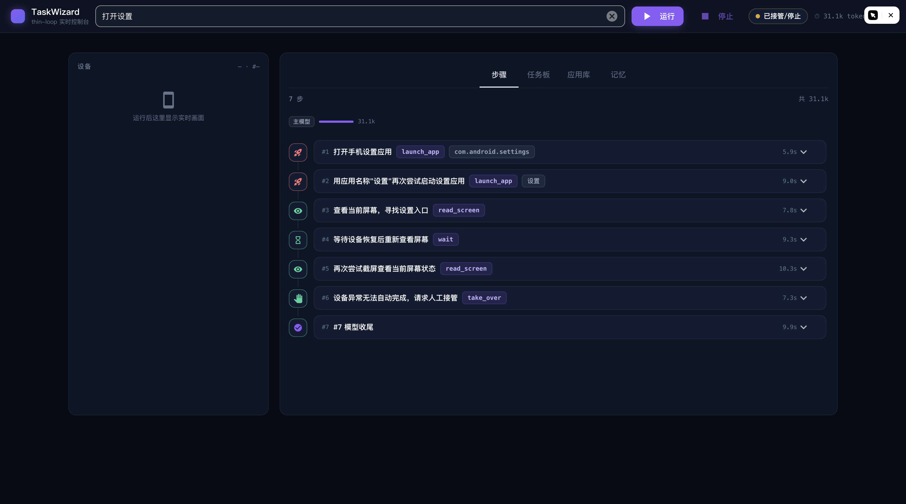

# Web 控制台

TaskWizard 自带本地 Web 控制台（NiceGUI），用于实时监看与操控运行。

```bash
.venv/bin/python -m phone_agent.web --device-id <serial> --port 8080
# 打开 http://127.0.0.1:8080
```



## 界面

- **顶栏**：任务输入（回车即运行）+ 状态药丸（运行中带脉搏动画）+ 实时 token 计数 + 配置抽屉开关；
- **左栏·设备**：实时画面（等比完整显示，无裁切）+ 胶片条截图历史——点缩略图钉住某一帧，再点回到"跟随最新"；
- **主区四个页签**：
  - **步骤**：时间线视图——每步一个状态节点（工具专属图标 + 状态色环，运行中呼吸发光），意图 / 工具 / 目标芯片 / 耗时条；**点步骤卡片，左侧画面直接钉到那一步的截图**；展开看参数与回执全文；
  - **任务板**：TaskDoc 结构化渲染——目标卡、路线检查单（状态图标 + 证据）、紧凑流程线；
  - **应用库**：App-KB 条目（名称/包名/来源/成功次数）+ 手动 dream 整理；
  - **记忆**：能力状态（生效/影子/关闭/待岗）、回想统计（评估数/命中率/误命中率）、任务档案表（时间/任务/成败/步数/token/验收）。

## 操控

- **停止 = 软停止**：当前步完成后安全收尾，不把手机留在不一致状态；
- **人工中断**：`ask_user` / `take_over` / hard 档安全确认时弹出横幅，输入回答继续；
- **配置抽屉**：每次运行的覆盖配置（设备/模型/安全模式/预算/grounding/App-KB），**只本轮生效，永不写回 .env**；
- token 用量按角色分列（主模型/压缩/验收器/安全复核），与 token 预算同口径。

## 设计边界

控制台是**可选观察层**：纯 CLI 用法完全不变；无界面时所有机制照常工作。
