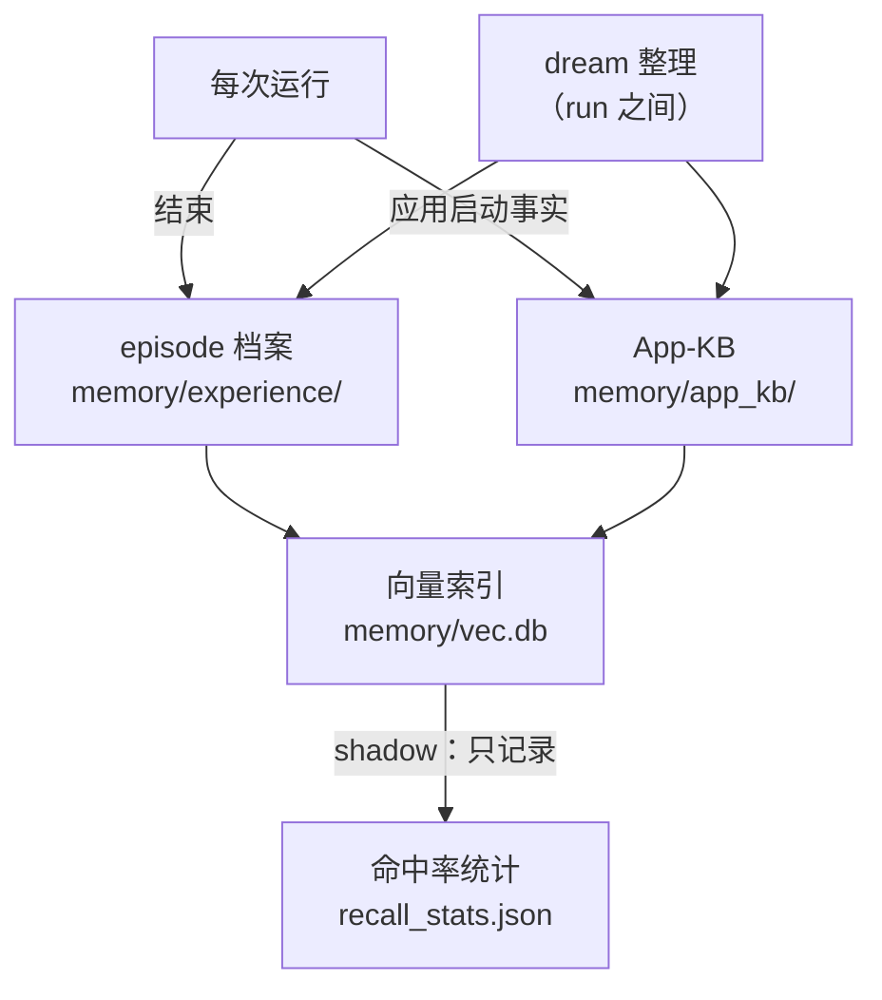
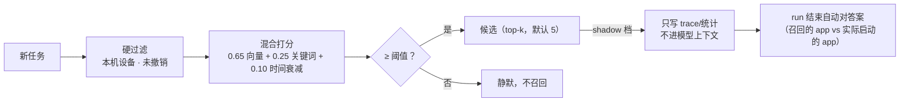

# 记忆与自进化

TaskWizard 的记忆分三层，全部本地存储（`memory/`），不依赖外部服务。

## 总览

## 第一层：App-KB（应用事实库）

记录本机可启动应用及其别名，按设备序列号隔离。

写入路径：

| 来源 | 条件 | 优先级 |
|---|---|---|
| `device` | run 启动时同步本机应用清单 | 最低（可被覆盖） |
| `learned` | 启动成功且叫法与官方名不同；或"中文叫法失败→候选包名成功"的隐式纠正 | 中 |
| `user` | 用户明确纠正 | 最高 |

存储为 JSONL 事件日志 + 可重建的 `kb.json` 视图。`dream` 在 run 之间整理：淘汰已卸载应用、衰减长期未用条目（`--dream` 或 `PHONE_AGENT_DREAM=auto`）。

## 第二层：episode 经验档案

每次 run 结束写一条结构化档案（`memory/experience/`）：目标（脱敏）、成败与终局原因、步数、分角色 token、警告次数、验收判决、涉及应用、时段/星期、能力快照。

- 隐私白名单：只存上述骨架字段；输入内容、mark 文本、截图永不落盘；
- observe-only：记录不改变模型行为；
- 超量（默认 500 条）或超龄（默认 90 天）的档案由 dream 折叠为聚合统计。

## 第三层：语义回想（RAG，默认 shadow）

- 嵌入模型：本地 MLX 运行 Qwen3-Embedding-0.6B（`PHONE_AGENT_EMBED_MODEL` 可换）；
- 索引可重建：`--rebuild-vec` 从事件日志全量重建；
- shadow 统计（命中率/误命中率）显示在控制台「记忆」页；达标前不开启注入。

## 下一步：提炼与晋升（未实现）

用 LLM 对成功/失败档案做对照蒸馏，产出候选经验；经 Rule-of-3（至少 3 次独立出现）与人工确认后晋升为正式经验；晋升经验在相关任务开局注入（上限 3+1 条 / 800 token），可一键撤销。

原则：先记录、再影子验证、最后才改变模型行为；每一步可回退。
